# Terraform-Azure-vWAN

This is a demo setup of the Azure vWAN service I use for demo purposes.

## Topology

### Disclaimer 
Please note the Azure vWAN service is not free. This setup should cost a few euros per day if you are not processing any traffic. I do not take any responsibility for any cost or problems generated if you use this project without knowing about Azure cost and pricing. 
